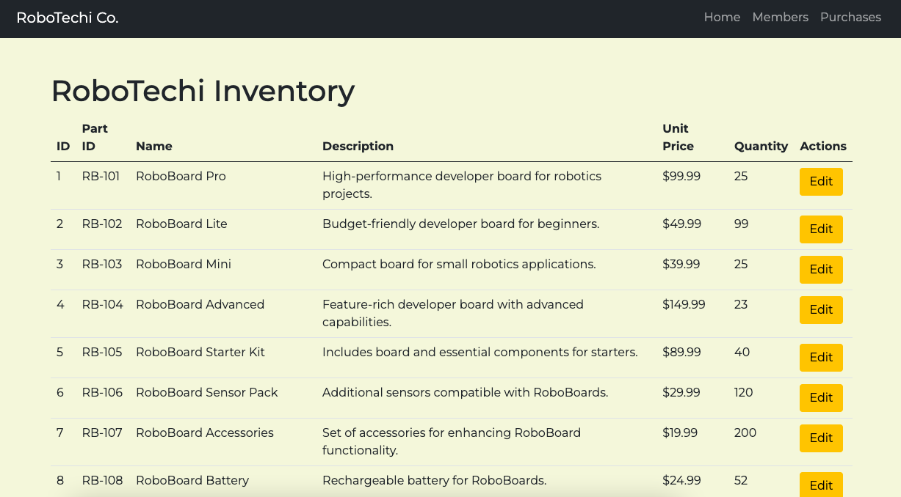

# ROBOTECHI SmartHub App

 

#### Overview:

RoboTechi is a cutting-edge technology startup dedicated to empowering innovators, hobbyists, and professionals through high-quality developer boards and electronic components. 

They wanted me to create a database via postgres that will hold the data for product inventory, memberships of customers and the products they sold. The database will allow the admin to access prior purchases of the members as well. 

# Tasks

Build the Database: Postgresql
Build FrontEnd: FastAPI, pg8000, Bootstrap5.
Test Application.

# Future Addons
- Add data visualization pg showing highest and lowest paying customers, highest product sold, and highest paying members.

## Technologies:

pip install fastapi[all] uvicorn pg8000

Frontend: FastAPI and Bootstrap5

Backend: FastAPI, uvicorn and pg8000    

Database built on PSQL.

Security testing (pending)

## Schema:
- robotechi
    - inventory
    - purchases
    - members

## Issues:
- update customers info of email, addresss and phone. 
- no updates of the purchases should be edited.

